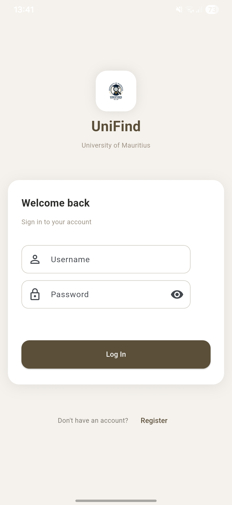
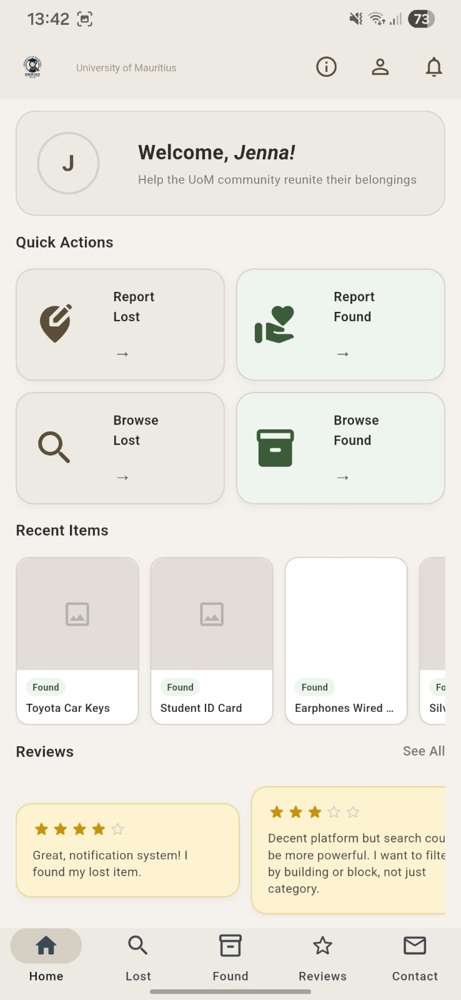
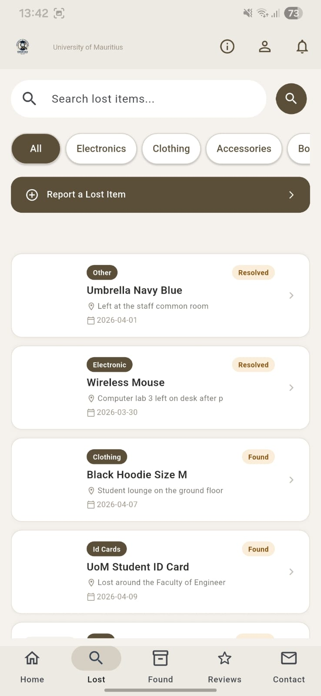
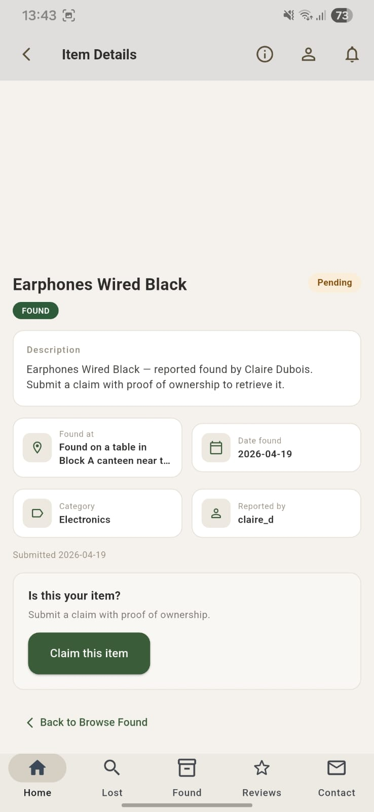
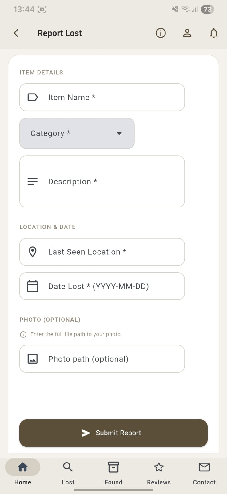
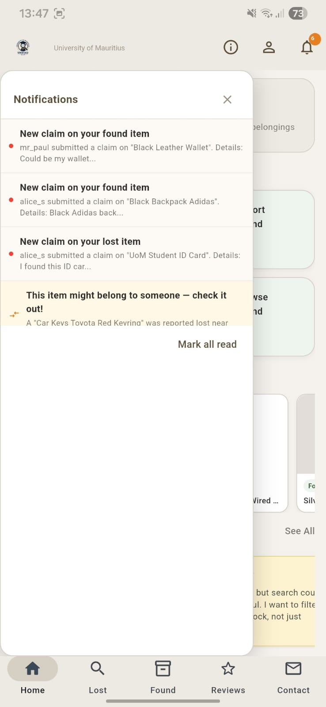

# UniFind

> A mobile lost & found platform , powered by [Flet](https://flet.dev/) and a Django REST API backend.  
> Inspired by an acadmeic assignment

---

## Screenshots

| Login | Home | Browse Lost Items |
|-------|------|-------------------|
|  |  |  |

| Item Detail | Report Lost | Notifications |
|-------------|-------------|---------------|
|  |  |  |

---

## About

**UniFind** is a campus lost-and-found application designed to help students and staff at the University of Mauritius report, browse, and recover lost or found items. Instead of paper notices or scattered WhatsApp messages, UniFind provides a single organised platform where users can:

- Report an item they have **lost** or **found** on campus
- Browse active listings with photo evidence and category filters
- Submit a **claim** on an item with a written proof of ownership
- Receive real-time **notifications** when a potential match is detected
- Leave and like **reviews** to build community trust
- Contact the administration directly through the app

The frontend is built entirely with **Flet** (Python), rendering a native-feeling mobile UI (390 × 844 px) that runs on desktop during development and can be packaged for Android/iOS.

---

## Features

### Authentication
- User registration and login with JWT tokens
- Tokens persisted locally in `.token.json` for seamless session restoration
- Automatic redirect to login for protected routes

### Lost & Found Listings
- Browse lost items and found items in separate, searchable feeds
- Filter by **keyword**, **category**, and **date**
- Upload a photo when reporting an item

### Item Details & Claims
- View full item details including description, location, date, and photo
- Submit a ownership claim with a written statement
- Track your own submitted claims from your profile

### Notifications
- Live notification polling every 15 seconds (background thread)
- Unread badge on the bell icon, colour-coded by type:
  - Red — general unread notification
  - Orange — potential item **match** detected
- Mark individual or all notifications as read
- Tap a notification to navigate directly to the relevant item

### Reviews
- Community review board (authentication required)
- Like other users' reviews

### Profile
- View your reported lost and found items
- Edit profile information

### Contact
- Send a message to the platform administrators directly from the app

### About
- In-app about page describing the platform

---

## Project Structure

```
UniFind - Flet/
├── main.py              # App entry point, routing, navigation bar, notifications
├── api.py               # All HTTP calls to the Django REST backend
├── storage.py           # JWT token persistence (load / save / clear)
├── assets/
│   └── logo.png         # App logo
└── views/
    ├── login.py
    ├── register.py
    ├── home.py
    ├── browse_lost.py
    ├── browse_found.py
    ├── report_lost.py
    ├── report_found.py
    ├── profile.py
    ├── edit_profile.py
    ├── reviews.py
    ├── contact.py
    ├── about.py
    ├── item_detail.py
    └── submit_claim.py
```

---

## Setup & Installation

### Prerequisites

- Python 3.10+
- A running instance of the [UniFind Django backend](https://github.com/Jenna-LHW/UniFind) on `http://127.0.0.1:8000`

### 1. Clone the repository

```bash
git clone https://github.com/Jenna-LHW/UniFind---Flet.git
cd "UniFind - Flet"
```

### 2. Install dependencies

```bash
pip install flet requests
```

### 3. Run the app

```bash
python main.py
```

The app window will open at 390 × 844 px (iPhone 14 Pro dimensions) for a realistic mobile preview.

---

## API Overview

All backend communication is handled in `api.py`. The base URL defaults to:

```
http://127.0.0.1:8000/api
```

To point to a remote server, change the `BASE` constant in `api.py`.

| Module | Endpoints |
|--------|-----------|
| Auth | `POST /auth/login/`, `POST /auth/register/`, `GET/PATCH /auth/user/` |
| Lost Items | `GET /lost-items/`, `POST /lost-items/`, `GET /lost-items/{id}/` |
| Found Items | `GET /found-items/`, `POST /found-items/`, `GET /found-items/{id}/` |
| Claims | `POST /claims/`, `GET /claims/` |
| Reviews | `GET /reviews/`, `POST /reviews/`, `POST /reviews/{id}/like/` |
| Notifications | `GET /notifications/`, `PATCH /notifications/{id}/`, `POST /notifications/mark-all-read/` |
| Contact | `POST /contacts/` |

---

## Navigation & Routing

Routing is handled manually via a `go(route_name)` callback passed to every view. Routes are plain strings:

| Route string | View |
|---|---|
| `login` | Login screen |
| `register` | Registration screen |
| `home` | Home / dashboard |
| `browse_lost` | Browse lost items |
| `browse_found` | Browse found items |
| `report_lost` | Report a lost item |
| `report_found` | Report a found item |
| `profile` | User profile |
| `edit_profile` | Edit profile |
| `reviews` | Community reviews |
| `contact` | Contact form |
| `about` | About page |
| `item_detail_{type}_{id}` | Dynamic item detail (e.g. `item_detail_lost_42`) |
| `submit_claim_{type}_{id}` | Submit a claim on an item |

The bottom navigation bar covers the five primary tabs (Home, Lost, Found, Reviews, Contact). All other routes show a back arrow in the app bar.

---

## Design System

| Token | Value |
|-------|-------|
| Primary brown | `#5c4f3a` |
| Background | `#f5f2ee` |
| Nav bar background | `#ede9e3` |
| Nav indicator | `#d6cfc4` |
| Window size | 390 × 844 px |

The palette is intentionally warm and paper-like, evoking campus noticeboards.

---

## Future Improvements

The following features are planned or recommended for future development:

### Core Functionality
-**Push notifications** — Replace the 15-second polling thread with WebSocket or FCM push notifications for instant, battery-efficient alerts
-**Image gallery** — Allow multiple photos per lost/found report, not just one
-**Claim approval flow** — Let item reporters accept or reject claims from within the app, rather than only via the admin panel
-**Item status tracking** — Add `open`, `claimed`, and `resolved` statuses to listings so users know which items are still available
-**Chat / messaging** — Allow claimants and reporters to message each other directly once a claim is submitted, removing the need to share personal contact details

### Search & Discovery
-**Map / Geolocation** — When reporting an item, capture the device's GPS coordinates via `flet.Geolocator` and store them with the report. On the browse and item detail screens, render an embedded map (e.g. using a `flet.WebView` pointing to a Leaflet.js or Google Maps tile) so users can see exactly where an item was lost or found on campus. A dedicated map tab could plot all open reports as pins, colour-coded by type (red = lost, green = found), letting users spot clusters at a glance.
-**Smart matching** — Surface potential matches automatically when a new item is reported (e.g. "A blue umbrella was found near the Library — does it match your report?")
-**Saved searches** — Let users subscribe to a keyword or category and receive a notification when a matching item is posted

### User Experience
-**Dark mode** — Support `ft.ThemeMode.DARK` with an equivalent dark colour palette
-**Pagination / infinite scroll** — The browse views currently load all items at once; add page-based or cursor-based pagination for performance at scale
-**Offline support** — Cache the last-fetched item list locally so the app is usable without a network connection
-**Camera integration** — Use `flet.FilePicker` in combination with the native camera intent (on Android/iOS builds) so users can take a photo directly when reporting an item rather than only selecting one from their gallery. On desktop, fall back to the standard file picker. Optionally auto-compress the image before upload to keep API payloads small.

### Platform & Deployment
-**Android / iOS packaging** — Use `flet build apk` and `flet build ipa` to distribute the app natively
-**Web build** — Deploy a web version (`flet build web`) accessible from any browser without installation
-**Environment configuration** — Replace the hardcoded `BASE` URL in `api.py` with a `.env` file or build-time config flag

### Security & Quality
-**Token refresh** — The `refresh_token` function in `api.py` exists but is not yet wired to auto-retry on 401 responses
-**Input validation** — Add client-side validation to all forms before the API call is made
-**Error boundary views** — Show a user-friendly error screen when an API call fails instead of silently doing nothing

